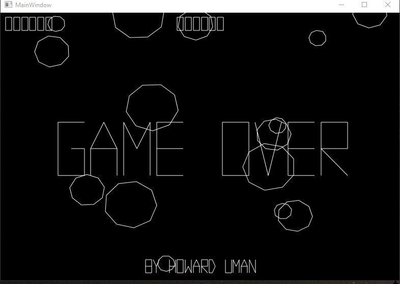

# Asteroids WebAssembly

## Live Demo: https://aesalazar.github.io/AsteroidsWasm/

This project is a POC to determine the plausibility of writing a .NET Standard library and using it across devices INCLUDING WebAssembly (WASM).  The root library, Asteroids.Standard, encapsulates all logic for rendering the classic '80s video game.  None of this is meant to be production-worthy.  It is more me just messing around trying to see what works.

      

The original code was adopted from a very cool WinForms project on CodePlex by Howard Uman, circa 2004:

https://www.codeproject.com/articles/7428/c-asteroids

It was chosen because it was already in C# and very straight forward in terms of inheritance and logic.  Separating the logic from the UI layer was relatively simple.

Currently, the project is made of the following:

- Asteroids.Standard - .Net Standard Library containing the game engine.

- Asteroids.WinForms - Reconstructed WinForms GUI that uses the game engine with a [PictureBox](https://docs.microsoft.com/en-us/dotnet/api/system.windows.forms.picturebox) as the main renderer.  This is using the .NET Framework 4.8.

- Asteroids.Wpf - Equivalent WPF GUI to the WinForms applications that uses a WPF [WriteableBitmap](https://docs.microsoft.com/en-us/dotnet/api/system.windows.media.imaging.writeablebitmap) as the main renderer with help from the [WritableBitmapEx](https://github.com/teichgraf/WriteableBitmapEx/) library.  This is using the .NET Framework 4.8.

- Asteroids.Wpf.Core - Identical in code to the Asteroids.Wpf project but using .NET Core 3 (see below for more info).

- Asteroids.Xamarin - The core Xamarin application that uses SkiaSharp for 2D rendering via a [SKCanvasView](https://docs.microsoft.com/en-us/dotnet/api/skiasharp.views.forms.skcanvasview).

- Asteroids.Xamarin.Android - Android GUI that uses the core Xamarin library.

- Asteroid.Xamarin.UWP - UWP GUI that uses the core Xamarin library.

- Asteroids.Blazor - WASM project that uses Microsoft's [Blazor](https://dotnet.microsoft.com/apps/aspnet/web-apps/client) to allow cross-compiling the C# code to WASM so it can be rendered in a browser (see below for more info).

- Asteroids.BlazorComponents - Blazor Class Library that contains the actual game engine instantiated object and associated HTML and JavaScript bridge to allow rendering in the browser.

## General Notes

All applications are written in Visual Studio so they can be launch simply by doing `Debug -> Start New Instance`.  Note that the Blazor and Wpf Core projects require Visual Studio 2019 or the latest Visual Studio Code to edit and compile; otherwise it can be done via Command Line.

The Android application will need some additional configuration like any other Xamarin project, e.g. I test in an Oreo VM running on my dev machine.

All applications are fully functional in terms sound and keyboard support.  Performance varies among the technologies with the Wpf Core being the clear winner for desktop and Firefox for Blazor/Web.

## Xamarin Notes

There is no Xamarin iOS app at this point only because Apple does not allow development on non-macs (which is what I am on) without connected hardware.  But there is no technical reason for it not to be possible.

The UWP application is set to require the Windows 10 Fall Creators Update at a minimum.  This is necessary to run the latest .NET Core and Standard versions.

## Blazor Notes

Microsoft has made Blazor offically part of .NET Core 3 and, as of the time of this writing, is currently in Preview.  So, version control will be important when trying to build and run this app. Currently, the app is using .NET Core 3 Preview 4.

To build the app, simply do it from Visual Studio - just make sure you have all dependencies listed on their Getting Stated page at [Blazor](https://dotnet.microsoft.com/apps/aspnet/web-apps/client). Doing it from CLI in the Asteroids.Blazor project folder is also an option:

`dotnet build`

To run the application, simply hit F5 or ctrl+F5 in Visual Studio or from the CLI:

`dotnet run`